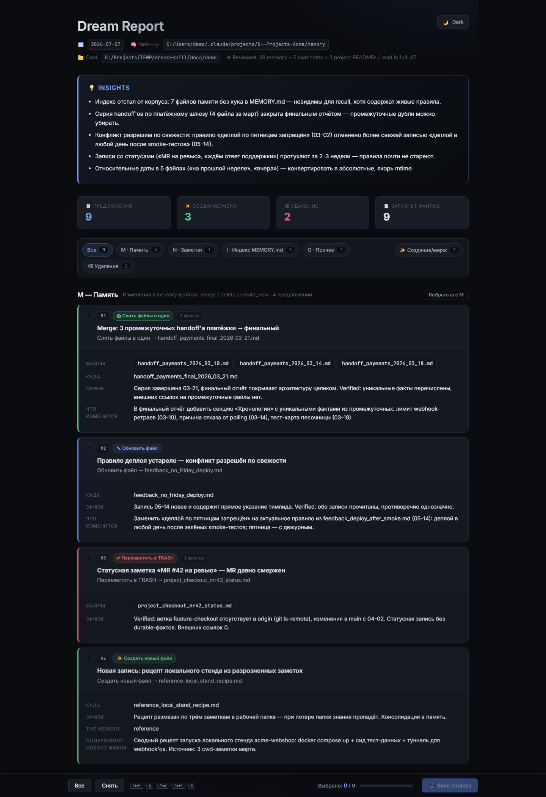
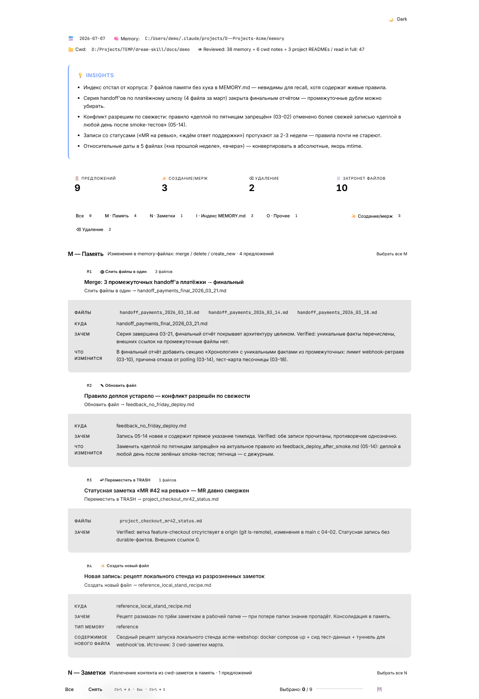
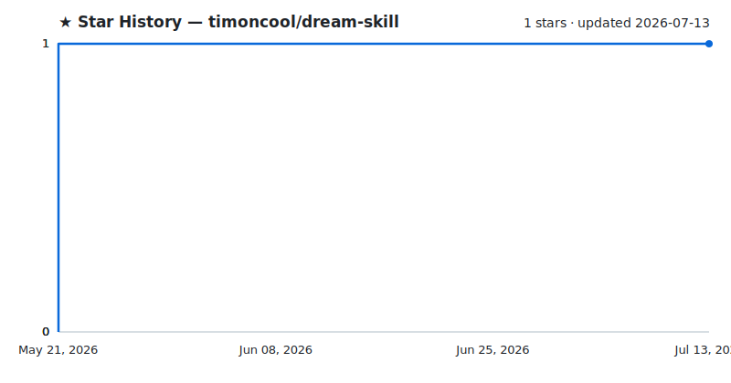

<div align="center">

# dream-skill

**Парные Claude Code скиллы для безопасной консолидации памяти — читаем, рефлексируем, применяем только то, что отметили галочкой.**

[](LICENSE)
[](https://github.com/timoncool/dream-skill/stargazers)
[](https://github.com/timoncool/dream-skill/commits)

**[English](README.md)** · **[Русский](README_RU.md)**



</div>

---

`dream` обходит папку памяти Claude Code, заметки в рабочей папке и README проектов, после чего синтезирует предложения по консолидации в HTML-отчёт с тёмной темой и чекбоксами. `wake` читает твой выбор и применяет только то, что ты явно отметил — никогда не меняет файлы вне выбранных, никогда не использует `rm`. Вдохновлён утечкой autoDream из внутренностей Claude Code, но с явным human approval gate, которого в оригинале нет.

## Возможности

- **Read-only обход** — dream пишет только файлы отчёта, не может случайно изменить память или заметки
- **Evidence policy** — ничто не помечается «устаревшим» без проверки `test -e` / `grep`; непроверяемое получает метку `[UNVERIFIED]` и никогда не применяется автоматически
- **Auto mode с независимым валидатором** — агент со свежим контекстом сам перепроверяет каждый proposal по файлам и одобряет вместо тебя; **full-auto** разруливает всё без рук
- **Snapshot + rollback** — полный снапшот памяти перед каждым apply; `откати сон` возвращает всё одной командой (и сам откат тоже обратим)
- **Output hygiene** — в консолидированных записях никогда нет мета-нарративов («юзер поправлял 3 раза»), session ID и историй неудач
- **Рефлексивный синтез** — Phase Reflect находит паттерны, дрейф, пробелы и противоречия между файлами (расширение поверх оригинального autoDream)
- **HTML UI с чекбоксами** — тёмная/светлая тема с переключателем, цветная полоска слева на каждой карточке (видна **до клика**), чипы файлов, два ряда фильтр-пилюль, sticky прогресс-бар, полная клавиатурная навигация, a11y `:focus-visible`, `prefers-reduced-motion`
- **Надёжный JSON-block контракт** — proposals встроены как fenced JSON блоки в отчёт; wake парсит regex-ом, защищён от любого markdown drift
- **12 типов действий** — `update` / `merge` / `delete` / `soft_delete` / `create_new` / `extract` / `remove_links` / `shorten_lines` / `add_links` / `promote_skill` / `retire_skill` / `purge_trash` (TRASH → `_archive/` через 30 дней)
- **Skill harvest** — если установлен луп самообучения [satori](https://github.com/timoncool/satori), dream читает его staged-драфты скиллов + телеметрию использования и выносит promote/retire через тот же гейт
- **Двухуровневая корзина** — `soft_delete` → `memory/TRASH/` → через 30 дней `purge_trash` предлагает вынести в `_archive/`. Никаких `rm`.
- **Cross-project global mode** — опциональный `dream global` сканирует все `~/.claude/projects/*/memory/`, находит дубли feedback'ов скопированные между проектами, мёртвые memory dirs, паттерны drift
- **Append-only лог заметок** — переживает компакшен контекста; Phase Reflect читает с диска, не из RAM
- **Lock против race-condition** — атомарный `mkdir <cwd>/.dream-lock/` (и `.wake-lock/`) предотвращает порчу notes log при параллельном запуске; stale locks (>1ч) auto-recover
- **TodoWrite трекинг прогресса** — по группам файлов (memory / cwd notes / projects), критично при 100+ файлах
- **Win11 Git Bash совместимость** — `pwd -W` для slug, `cygpath` для путей в Python
- **Опциональный auto-trigger** — `SessionEnd` hook recipe в README для autoDream-like автономности без потери human approval gate
- **Безопасен по дизайну** — `wake` делает `mv` только в `TRASH/` или `_archive/` (восстанавливаемо), никогда `rm`

## Быстрый старт

1. **Клонируем**
   ```bash
   git clone https://github.com/timoncool/dream-skill.git
   ```

2. **Устанавливаем** (рекомендую per-project; глобально тоже работает)
   ```bash
   cd <твой-проект>
   mkdir -p .claude/skills
   cp -r /path/to/dream-skill/dream .claude/skills/
   cp -r /path/to/dream-skill/wake .claude/skills/
   ```

3. **Запускаем** (сначала перезапусти Claude Code, чтобы скиллы подгрузились)
   ```
   поспи         # или "dream" / "consolidate memory"
   # ... открываешь HTML-отчёт, ставишь галочки, жмёшь Save choices ...
   проснулся    # или "wake" / "apply dream"
   ```

## Использование

### Dream — читай и рефлексируй

Триггер-фразы (RU/EN): `поспи`, `сон`, `режим сна`, `dream`, `консолидируй память`, `разберись с памятью`, `audit memory`, `consolidate memory`, `synthesize`.

Output:
- `<cwd>/.dream-notes-<date>.md` — append-only лог (per-file блоки, пишутся инкрементально)
- `<cwd>/.dream-payload-<date>.json` — input для `build_report.py`
- `<cwd>/DREAM-REPORT-<date>.md` — полный audit trail с одним fenced JSON блоком на proposal
- `<cwd>/DREAM-REPORT-<date>.html` — интерактивный UI
- `<cwd>/.dream-lock/` — каталог-лок против race (удаляется при завершении; stale-recover после 1ч)

### HTML UI

Открой HTML в браузере:
- 🟢 **Конструктивные действия** (merge, create_new, extract) — зелёная полоска слева
- 🔴 **Деструктивные действия** (delete, soft_delete, purge_trash) — красная полоска
- 🔵 **Нейтральные действия** (update, операции с индексом) — синяя полоска

Цветовая кодировка видна **до клика** — на отчёте из 50 карточек деструктив видишь сразу.

**Фильтры** (два ряда): верхний — по категории (M/N/I/S/O) или action class (constructive/destructive); нижний (только в global mode) — по проекту. Фильтры объединяются по AND, счётчики обновляются live.

**Кнопка "Выбрать все M/N/I/O"** рядом с заголовком каждой секции — массовый select внутри одной категории без затрагивания других.

**Save choices** — Chrome/Edge спросит куда сохранить через FS Access API, Firefox/Safari скачает в `~/Downloads/`. Выбор хранится в `localStorage` (namespace по hash от cwd) — случайно закрытая вкладка не теряет работу.

**Клавиатура:**
- `Ctrl+A` — выбрать всё (видимое под фильтрами)
- `Esc` — сбросить всё; повторный `Esc` восстановит предыдущий выбор (undo)
- `Ctrl+S` — сохранить
- `T` — переключить тёмную/светлую тему

### Global mode — cross-project аудит

Триггер: `поспи глобально`, `dream global`, `audit all memory`. Сканирует **все** `~/.claude/projects/*/memory/` директории сразу, не только по cwd-slug'у. Полезно для поиска межпроектных дублей feedback-файлов (один и тот же `feedback_X.md` скопирован в 5 проектов без синка), мёртвых memory dirs от заброшенных проектов, паттернов drift между проектами.

В global mode:
- Каждый proposal затрагивающий память получает поле `project: <slug>`
- HTML отчёт показывает дополнительный ряд фильтр-пилюль по проектам (`⌂ Все проекты`, дальше по одной на проект)
- Каждая карточка показывает project chip в header
- `wake` резолвит `project` slug в нужный memory dir перед apply'ем

В global mode cwd notes / project READMEs **не сканируются** — слишком дорого, фокус только на memory dirs.

### Wake — применяет выбранное

Триггер: `проснулся`, `wake`, `apply dream`, `wake M1,M3,N2`, `wake all`.

Wake находит `DREAM-CHOICES-<date>.json` (cwd → `~/Downloads/` → `~/Desktop/`), парсит JSON блоки из отчёта, показывает summary, спрашивает один раз подтверждение, потом делает **полный снапшот памяти** в `_archive/wake-backup-<date>/` и применяет только отмеченные пункты через `Edit`/`Write` и `mv` в `TRASH/`/`_archive/`. Дописывает секцию `## Wake log — <timestamp>` в отчёт для audit trail.

### Auto и полный автосон — валидатор вместо тебя

| Режим | Триггер | Кто решает | Остаётся тебе |
|-------|---------|------------|---------------|
| Ручной | `поспи` → галочки → `проснулся` | ты | всё |
| Auto | `автосон` / `поспи сам` | валидатор, кроме деструктива | `delete`, `purge_trash`, `promote_skill`, `[UNVERIFIED]` |
| Full-auto | `полный автосон` | валидатор решает всё | ничего — «откати сон», если что |

В авто-режимах после сборки отчёта dream спавнит **независимого агента-валидатора** (свежий контекст — сессия, писавшая proposals, не должна их же одобрять). Дефолт валидатора — *отклонить*: он сам перечитывает затронутые файлы, сам перепроверяет evidence и возвращает вердикт на каждый proposal. Одобренное уходит в `DREAM-CHOICES` с `"auto": true`, wake применяет без ожидания. В full-auto `delete` получает обязательный pre-delete бэкап в `TRASH/`, а непроверяемое разруливается консервативно — «оставить как есть»; каждый proposal получает исход, тебе ничего не откладывается.

### Rollback — откат

```
откати сон                # восстановить память из последнего снапшота
wake rollback 2026-07-07  # ...или из снапшота конкретной даты
```

Восстанавливает memory dir из `_archive/wake-backup-*/`. Перед восстановлением текущее состояние тоже снапшотится — откат можно откатить. Файлы, созданные после снапшота, перечисляются, а не удаляются молча.

## Лучше всего работает вместе с satori

[**satori** 悟り](https://github.com/timoncool/satori) — родной брат этого проекта: луп самообучения (MCP + хуки), который прямо в сессии превращает твои коррекции и падения тулзов в *драфты скиллов*. Вместе они замыкают полный цикл обучения:

```
satori (внутри сессии)            dream/wake (между сессиями)
коррекции и падения  ──────▶  фаза Skill harvest читает staging
→ кандидаты в уроки           satori + телеметрию использования
→ SKILL.md драфты в staging ─▶ proposals promote_skill / retire_skill
   (сами НЕ активируются)     → твои галочки или валидатор
                              → wake активирует или хоронит; rollback
                                покрывает и скиллы
```

dream/wake ведёт **фактическую память** (заметки, правила, индекс), satori — **процедурную** (скиллы). Каждый работает сам по себе; вместе — сон → пробуждение → прозрение.

## Auto-trigger (опционально)

По дизайну `dream` запускается только явно — это философское отличие от autoDream. Но если хочешь autoDream-like автономность без audit-проблем — добавь `SessionEnd` hook в `~/.claude/settings.json`:

```json
{
  "hooks": {
    "SessionEnd": [{
      "matcher": "*",
      "hooks": [{
        "type": "command",
        "command": "test $(find ~/.claude/projects/$(pwd | sed 's:[/\\]:-:g')/memory -name '*.md' -newer ~/.dream-last-run 2>/dev/null | wc -l) -gt 5 && claude -p 'поспи' && touch ~/.dream-last-run"
      }]
    }]
  }
}
```

Триггерится если ≥5 memory файлов изменилось с последнего запуска. Всё равно генерит HTML отчёт — ты ревьюишь когда снова открываешь проект. Никаких автономных мутаций.

## Архитектура

```
dream/
├── SKILL.md                  # 4-фазный workflow + safety rules + paths + lock + global mode
├── references/
│   └── action_types.md       # JSON контракт для 12 типов действий + опциональное поле 'project'
└── assets/
    ├── template.html         # тёмная/светлая тема UI, только Google Fonts (~1150 строк)
    └── build_report.py       # payload JSON → MD + HTML, per-action валидация

wake/
└── SKILL.md                  # discover choices, parse JSON, summary gate, apply, lock
```

### JSON-block контракт

Каждый proposal в MD отчёте — fenced JSON блок. Wake парсит их Python regex-ом, защищён от любого markdown drift:

```json
{
  "id": "M1",
  "category": "memory",
  "action": "merge",
  "title": "Merge handoff_pikabu_*.md в project_pikabu_mcp.md",
  "rationale": "3 session handoffs накопились, последний — канонический",
  "files": ["handoff_pikabu_2026_03_30.md", "handoff_pikabu_2026_04_01.md"],
  "target": "project_pikabu_mcp.md",
  "diff_preview": "Append session sections, потом mv источников в TRASH/"
}
```

Полная схема всех 10 типов действий — в [`dream/references/action_types.md`](dream/references/action_types.md).

## Гарантии безопасности

**dream** — пишет только четыре файла отчёта, ничего больше:

- Read / Grep / Glob — без ограничений
- Read-only Bash: `ls`, `find` (без `-delete`/`-exec`), `grep`, `cat`, `head`, `tail`, `wc`, `du`, `stat`, `python` (только для build_report.py)
- Write только в: `<cwd>/.dream-notes-<date>.md`, `<cwd>/.dream-payload-<date>.json`, `<cwd>/DREAM-REPORT-<date>.md`, `<cwd>/DREAM-REPORT-<date>.html`
- Никаких `rm`, `mv`, `cp`, redirect, `find -delete`, никаких Edit/Write вне файлов отчёта
- Lock-каталог `<cwd>/.dream-lock/` (атомарный mkdir) предотвращает порчу notes log при параллельном запуске; stale-lock (>1ч) auto-recover

**wake** — деструктивные операции ограничены:

- `Edit`/`Write` только в `<memory_dir>/` (или `~/.claude/projects/<project>/memory/` если у proposal есть поле `project`) и явно перечисленных cwd notes из выбранных proposals
- `mv` только в `<memory_dir>/TRASH/`, `<cwd>/_archive/dream-applied-<date>/`, или `<cwd>/_archive/trash-purged-<date>/` (для `purge_trash`)
- Никогда `rm` (всегда `mv` = восстанавливаемо)
- Полный снапшот памяти (`cp -r`) в `_archive/wake-backup-*/` перед любым apply — гарантированный откат одной командой
- `cp` разрешён только для снапшотов, pre-delete бэкапов в `TRASH/` и восстановления при rollback
- Не работает с пунктами, которых нет в `selected`
- Не трогает папки проектов
- Тот же механизм lock как у dream (`<cwd>/.wake-lock/`) предотвращает параллельный apply

## Зачем это нужно

В утечке Claude Code v2.1.88 есть `autoDream` — фоновый pass консолидации памяти. Запускается автономно раз в ~24 часа, когда накопилось достаточно сессий. Оригинал страдает от [issue #38493](https://github.com/anthropics/claude-code/issues/38493): *"writes inaccurately named, factually unverified, impossible-to-audit memories"* — потому что никто из людей не проверяет что было смерджено или удалено.

`dream` + `wake` решают это жёстким разделением: dream — read-only и пишет только отчёт; wake применяет только явно одобренное — тобой через галочки в HTML или независимым валидатором в авто-режимах. Гейт есть всегда; меняется только тот, кто его держит.

В реальном full-auto прогоне по корпусу из 230+ файлов валидатор отклонил 2 из 18 предложений — одно потому, что «дубль» на самом деле содержал уникальные креды, второе — чтобы сохранить последний след потерянного правила. Так гейт и отрабатывает свой хлеб.

## Демо

Открой [`docs/demo/DREAM-REPORT-demo.html`](docs/demo/DREAM-REPORT-demo.html) в браузере — тот самый отчёт со скриншотов, сгенерированный из вымышленных данных. Чекбоксы, фильтры, темы и Save choices работают.



## Вдохновение

- **autoDream** из утечки Claude Code v2.1.88 — `services/autoDream/consolidationPrompt.ts` (4-фазный Orient → Gather → Consolidate → Prune)
- **createAutoMemCanUseTool** restrictions — `services/extractMemories/extractMemories.ts:171`
- **Memory taxonomy** (user/feedback/project/reference) и `WHAT_NOT_TO_SAVE` — `memdir/memoryTypes.ts`
- **MEMORY.md лимиты** (200 строк / 25KB) — `memdir/memdir.ts`
- **Plan-then-apply паттерн** — `skills/bundled/remember.ts` ("present proposals, do NOT modify without approval")
- **Phase Reflect (синтез поверх консолидации)** — Karpathy [LLM Wiki](https://gist.github.com/karpathy/442a6bf555914893e9891c11519de94f), идея lint-pass

## Другие проекты [@timoncool](https://github.com/timoncool)

| Проект | Описание |
|--------|----------|
| [satori](https://github.com/timoncool/satori) | Луп самообучения — скиллы из собственных сессий, за тем же гейтом |
| [telegram-api-mcp](https://github.com/timoncool/telegram-api-mcp) | Полный Telegram Bot API как MCP сервер |
| [civitai-mcp-ultimate](https://github.com/timoncool/civitai-mcp-ultimate) | Civitai API как MCP сервер |
| [trail-spec](https://github.com/timoncool/trail-spec) | TRAIL — cross-MCP протокол отслеживания контента |
| [ACE-Step Studio](https://github.com/timoncool/ACE-Step-Studio) | AI music studio — песни, вокал, каверы, видео |
| [GitLife](https://github.com/timoncool/gitlife) | Твоя жизнь в неделях — интерактивный календарь |
| [Bulka](https://github.com/timoncool/Bulka) | Платформа для live-coding музыки |
| [ScreenSavy.com](https://github.com/timoncool/ScreenSavy.com) | Генератор фоновых картинок |

## Авторы

- **Nerual Dreming** — [Telegram](https://t.me/nerual_dreming) | [neuro-cartel.com](https://neuro-cartel.com) | [ArtGeneration.me](https://artgeneration.me)

## Поддержать автора

Я делаю open-source софт и AI-ресёрч. Большинство того, что я создаю — бесплатно и доступно всем. Ваши донаты помогают мне продолжать творить, не думая о том, где взять деньги на следующий обед =)

**[Все способы доната](https://github.com/timoncool/ACE-Step-Studio/blob/master/DONATE.md)** | **[dalink.to/nerual_dreming](https://dalink.to/nerual_dreming)** | **[boosty.to/neuro_art](https://boosty.to/neuro_art)**

- **BTC:** `1E7dHL22RpyhJGVpcvKdbyZgksSYkYeEBC`
- **ETH (ERC20):** `0xb5db65adf478983186d4897ba92fe2c25c594a0c`
- **USDT (TRC20):** `TQST9Lp2TjK6FiVkn4fwfGUee7NmkxEE7C`

## Star History

<a href="https://github.com/timoncool/dream-skill/stargazers">
 <picture>
   <source media="(prefers-color-scheme: dark)" srcset="docs/stars-dark.svg" />
   <source media="(prefers-color-scheme: light)" srcset="docs/stars-light.svg" />
   
 </picture>
</a>

## License

MIT
